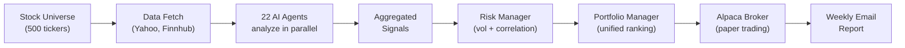
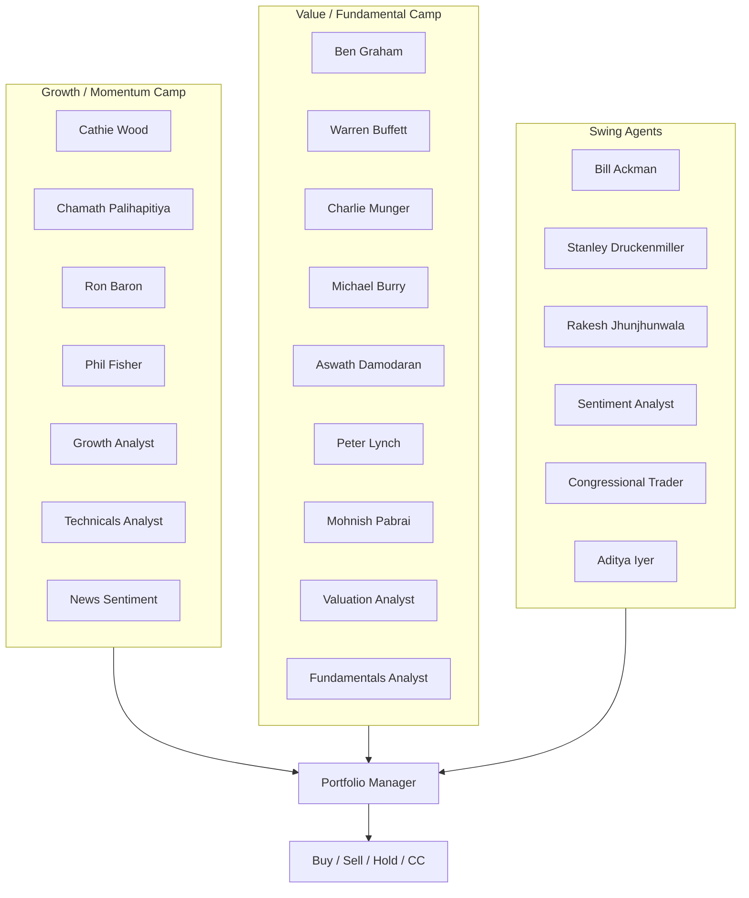
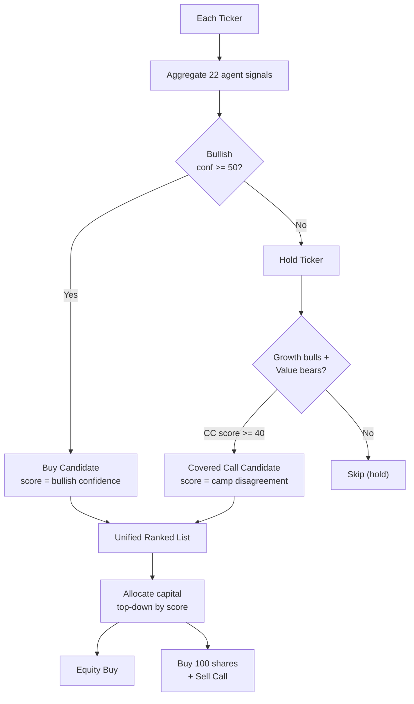
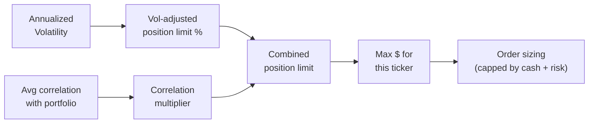

# Aletheia Capital — AI Hedge Fund

An AI-powered hedge fund that uses 22 specialized investment agents to analyze 500+ stocks weekly, make autonomous trading decisions, and execute via Alpaca paper trading. Built for automated weekly operation via GitHub Actions.

## How It Works

The system runs a weekly pipeline every Monday at market open:



**Each ticker gets scored by every agent independently.** Agents disagree — that's by design. A growth investor might love NVDA while a value investor hates it. The portfolio manager aggregates these weighted signals into actionable decisions.

## The 22 Agents

Agents are split into philosophical camps that drive both trading decisions and the covered call strategy:



Each agent uses a different LLM prompt embodying that investor's philosophy. Signals are weighted by historical accuracy (weights adjust automatically over time).

## Decision Engine

The portfolio manager scores every ticker for two possible actions:



**Buy and covered call opportunities compete for the same capital.** If a CC opportunity on AMD scores 60 and a directional buy on ABBV scores 58, AMD gets capital first. The system allocates to whatever it's most confident in.

### Covered Call Strategy

Covered calls target **only hold tickers** — never stocks the system wants to buy directionally (those need full upside). The ideal CC candidate has:

- **Growth agents bullish** (Cathie Wood, Chamath, etc.) → downside protection, the business is solid
- **Value agents bearish** (Graham, Burry, Damodaran) → upside is capped, stock is expensive

This creates a range-bound profile ideal for harvesting option premium. The CC confidence score is:

```
cc_score = min(growth_bull_pct, value_bear_pct) × avg_confidence
```

## Architecture

```
ai-hedge-fund-production/
├── weekly_scan_rebalancing.py  # Main entry point
├── src/
│   ├── agents/                 # 22 investment agent implementations
│   │   ├── base.py             # BaseAgent class
│   │   ├── registry.py         # Agent registry + weight management
│   │   ├── initialize.py       # Agent registration
│   │   ├── warren_buffett.py   # Value investing philosophy
│   │   ├── cathie_wood.py      # Disruptive innovation
│   │   ├── michael_burry.py    # Contrarian deep value
│   │   └── ...                 # 19 more agents
│   ├── broker/
│   │   └── alpaca.py           # Alpaca SDK (equities + options)
│   ├── data/
│   │   ├── providers/          # Yahoo Finance, Finnhub, Congressional
│   │   ├── universe.py         # Stock universe selection
│   │   └── models.py           # Price, FinancialMetrics, LineItem
│   ├── llm/
│   │   ├── models.py           # DeepSeek / Ollama model routing
│   │   └── utils.py            # Retry logic, JSON parsing
│   ├── options/
│   │   └── covered_calls.py    # Covered call manager
│   ├── portfolio/
│   │   ├── manager.py          # Decision engine + CC scorer
│   │   └── models.py           # Portfolio, Position models
│   ├── risk/
│   │   └── manager.py          # Volatility + correlation limits
│   ├── trading/
│   │   └── pipeline.py         # Weekly pipeline orchestrator
│   ├── performance/
│   │   ├── tracker.py          # Agent weight adjustment
│   │   └── cycle_tracker.py    # Cycle-over-cycle tracking
│   ├── scan_cache/             # Run persistence (full history; prune optional)
│   └── utils/
│       └── email.py            # HTML email reports
├── config/
│   └── agent_weights.json      # Dynamic agent weights
├── .github/workflows/
│   └── weekly-scan.yml         # GitHub Actions automation
└── tests/                      # Test suite
```

## Risk Management



| Volatility | Max Allocation | Correlation | Multiplier |
|------------|---------------|-------------|------------|
| < 15% | Up to 25% | >= 0.8 | 0.70x |
| 15-30% | 15-20% | 0.6-0.8 | 0.85x |
| 30-50% | 10-15% | 0.4-0.6 | 1.00x |
| > 50% | Max 10% | < 0.2 | 1.10x |

## Setup

### Prerequisites

- Python 3.9+
- [Poetry](https://python-poetry.org/docs/#installation)
- Alpaca paper trading account ([sign up free](https://alpaca.markets/))
- DeepSeek API key ([get one](https://platform.deepseek.com/)) or local Ollama

### Installation

```bash
git clone https://github.com/Adi1yer/Aletheia-Capital.git
cd Aletheia-Capital
poetry install
cp .env.example .env
```

### Configuration

Edit `.env` with your API keys:

```bash
# Required
ALPACA_API_KEY=your_alpaca_key
ALPACA_SECRET_KEY=your_alpaca_secret

# LLM (pick one)
DEEPSEEK_API_KEY=your_deepseek_key   # Recommended (~$2/run for 500 tickers)
# Or use local Ollama (free, slower)

# Optional
FINNHUB_API_KEY=your_finnhub_key     # Insider/analyst data
SMTP_SERVER=smtp.gmail.com           # Email notifications
SENDER_EMAIL=you@gmail.com
SENDER_PASSWORD=your_app_password
RECIPIENT_EMAIL=you@gmail.com
```

### Running

```bash
# Full weekly scan with execution (500 tickers, covered calls enabled)
poetry run python weekly_scan_rebalancing.py

# Custom run
poetry run python weekly_scan_rebalancing.py \
  --max-stocks 300 \
  --execute \
  --min-buy-confidence 50 \
  --enable-covered-calls \
  --email-to you@example.com

# Dry run (no trades)
poetry run python weekly_scan_rebalancing.py --max-stocks 100
```

### Automated Workflows

GitHub Actions schedules are defined in UTC:

- Weekly scan + rebalance: `0 16 * * 1` (Monday)
- Biotech catalyst scan: `0 16 * * 1` (Monday)
- Daily position health check: `0 16 * * 1-5` (Monday-Friday)

At `16:00 UTC`, runs are around `9:00 AM` Pacific during daylight time and around `8:00 AM` Pacific during standard time.

To set up:

1. Push code to your GitHub repo
2. Add secrets in **Settings → Secrets and variables → Actions**:
   - Weekly scan + rebalance: `ALPACA_API_KEY`, `ALPACA_SECRET_KEY`, `ALPACA_BASE_URL`, `DEEPSEEK_API_KEY`, `FINNHUB_API_KEY`, `SMTP_SERVER`, `SMTP_PORT`, `SENDER_EMAIL`, `SENDER_PASSWORD`, `RECIPIENT_EMAIL`
   - Biotech catalyst scan: `BIOTECH_ALPACA_API_KEY`, `BIOTECH_ALPACA_SECRET_KEY`, `DEEPSEEK_API_KEY`, `SMTP_SERVER`, `SMTP_PORT`, `SENDER_EMAIL`, `SENDER_PASSWORD`, `RECIPIENT_EMAIL` (optional: `BIOTECH_RECIPIENT_EMAIL`, `BIOTECH_TICKERS`)
   - Daily position health check: `ALPACA_API_KEY`, `ALPACA_SECRET_KEY`, `BIOTECH_ALPACA_API_KEY`, `BIOTECH_ALPACA_SECRET_KEY`
3. Workflows trigger automatically on schedule, or manually via **Actions → Run workflow**

## Weekly Email Report

Each run sends an HTML email containing:

- **Portfolio status** — cash, equity, top positions
- **Decisions summary** — X buys, Y sells, Z holds
- **Buy/sell orders** — ticker, quantity, confidence, reasoning
- **Covered calls** — contracts written, strikes, expiry, estimated premium
- **CC lot builds** — shares bought to reach 100-share lots
- **Failed orders** — any execution failures flagged
- **Past performance** — week-over-week equity change
- **AI weekly outlook** — LLM-generated 2-3 sentence market summary

## Key Parameters

| Parameter | Default | Description |
|-----------|---------|-------------|
| `--max-stocks` | 500 | Universe size (top N by market cap) |
| `--min-buy-confidence` | 50 | Minimum aggregated bullish confidence to buy |
| `--min-sell-confidence` | 60 | Minimum bearish confidence to sell existing longs |
| `--cash-buffer-pct` | 0.03 | Keep 3% of equity in cash |
| `--max-buy-tickers` | 30 | Max number of buy candidates per run |
| `--enable-covered-calls` | True | Enable covered call strategy on hold tickers |
| `--min-cc-score` | 40 | Minimum CC score to qualify |

## Performance

- **Parallel agent execution** — 22 agents run concurrently
- **Parallel data fetching** — all tickers fetched in parallel
- **Batch processing** — large universes processed in 100-ticker batches
- **Memory caching** — 24hr TTL to avoid redundant API calls
- **Dynamic agent weights** — agents that make better predictions get more influence over time

## Testing

```bash
poetry run pytest                              # All tests
poetry run pytest --cov=src --cov-report=html  # With coverage
poetry run pytest tests/test_agents.py         # Specific suite
```

## Disclaimer

This system is for educational and research purposes only. It operates exclusively on Alpaca paper trading accounts. Past performance does not guarantee future results. Options trading involves significant risk. Always do your own research before making investment decisions with real capital.
