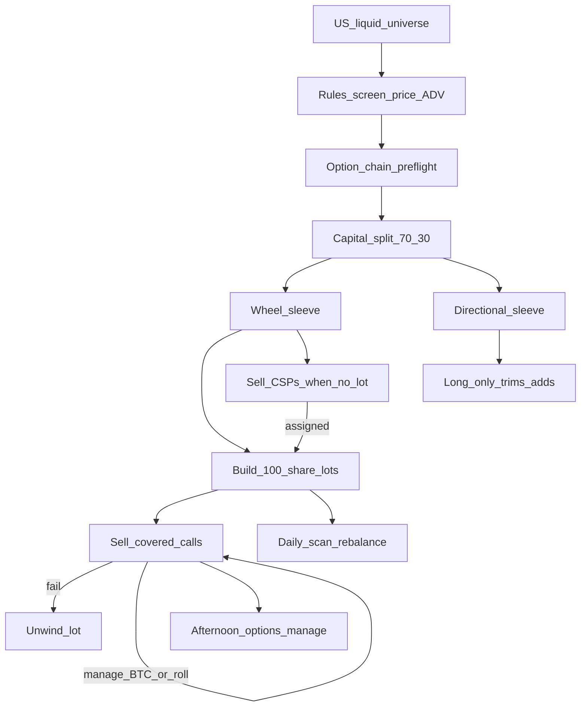

# Aletheia Capital — AI Hedge Fund

**Repository:** [github.com/Adi1yer/Aletheia-Capital](https://github.com/Adi1yer/Aletheia-Capital) · **Maintainer:** [@Adi1yer](https://github.com/Adi1yer)

Paper-trading system for a **~$10k wheel-hybrid** book: rules-first covered-call / CSP wheel (~70% of capital) plus a smaller directional equity sleeve (~30%). Agents still run as an overlay for learning and residual ranking; they do **not** pick wheel underlyings in v1.

> **Contributors:** Configure git so commits attribute to **Adi1yer** only (see [SETUP.md](SETUP.md#git-commit-identity)).

## Current mandate: `wheel-10k`

| Sleeve | Target | What it does |
|--------|--------|----------------|
| **Wheel** | ~70% of equity | 100-share lots in liquid names priced ≤ ~$35; sell covered calls; CSPs to enter when cash-heavy |
| **Directional** | ~30% of equity | Smaller long-only names (can be >$35); residual/momentum ranked |
| **Cash buffer** | ~6% | Kept for option collateral / slippage |

**Goal:** beat **SPY absolute return** over time by chasing option premium, while managing assignment with **roll-for-credit** (rules engine + CC agent overlay for ambiguous cases).

**Invariants (enforced in code):**

- Every open weekday the **Daily Wheel Scan & Rebalance** job runs (holiday/weekend skip only).
- **Fill-confirmed** critical path: BTC, rolls, CC writes, CSP, and wheel lot buys wait for broker fills (not submit-only).
- No 100-share wheel lot without a short **call** — write fails or unfilled ⇒ **same-session unwind** (also waited).
- New lots require **option-chain preflight** before buy; start-of-run uncovered lots are force-unwound.
- Threatened shorts (≤7 DTE, near-ITM, or ≥~60% profit) ⇒ BTC then roll with **policy B**: near-ITM/DTE allow small debit ≤ max($25, 25% of new premium); profit-take is **credit-only**.
- **Wheel-first capital**; directional uses residual cash and is capped at **99 shares** (no naked 100-lots outside the wheel path).
- Orphan exits never sell shares while a short option is open on that name.
- You get a **daily email** after every rebalance run (even if no trades). Afternoon options manage emails **only when something changed**.

Legacy **Beat SPY** (`beat-spy-10k`) remains in the repo but is **not** the scheduled paper runner.

## How It Works


```mermaid
flowchart TD
  universe[US_liquid_universe] --> screen[Rules_screen_price_ADV]
  screen --> preflight[Option_chain_preflight]
  preflight --> split[Capital_split_70_30]
  split --> wheel[Wheel_sleeve]
  split --> directional[Directional_sleeve]
  wheel --> lots[Build_100_share_lots]
  lots --> cc[Sell_covered_calls]
  cc -->|fail| unwind[Unwind_lot]
  wheel --> csp[Sell_CSPs_when_no_lot]
  csp -->|assigned| lots
  cc -->|manage_BTC_or_roll| cc
  directional --> equity[Long_only_trims_adds]
  lots --> daily[Daily_scan_rebalance]
  cc --> afternoon[Afternoon_options_manage]
```

1. **Daily scan** (`wheel-10k`): screen + preflight, allocate sleeves, orphan-exit, manage/roll shorts, write CCs/CSPs, **always email**.
2. **Afternoon options manage**: BTC / roll / rewrite on existing lots; email only if actions occurred.
3. **Market calendar gate**: every NYSE open weekday; RTH cutoff refuses new DAY orders after ~15:30 ET.

## Covered calls (wheel)

- Open band **~3–8% OTM** (target ~5%) — premium-leaning but still OTM.
- Minimum premium floors (`cc_min_premium_usd` / `cc_min_premium_pct`).
- **Atomic lots:** buy → write CC same session → else sell shares.
- **Rolls:** near-ITM / short DTE → BTC + STO new call preferring net credit; ambiguous → CC agent among precomputed contracts only.

## Architecture (high level)

```
weekly_scan_rebalancing.py          # Entry (--run-profile wheel-10k); runs daily via Actions
scripts/manage_wheel_options.py     # Afternoon CC manage / BTC / roll
scripts/should_run_daily_scan.py    # Weekday market-open gate
src/options/
  wheel_universe.py / covered_calls.py / wheel_lifecycle.py / cc_agent.py
src/portfolio/wheel_allocator.py    # 70/30 + preflight + atomic unwind hooks
src/utils/wheel_email.py            # Compact daily digest
config/run_profiles.json            # wheel-10k, beat-spy-10k, …
.github/workflows/
  daily-wheel-scan.yml              # Mon–Fri morning rebalance + email
  wheel-options-daily.yml           # Mon–Fri afternoon options manage
```

## Setup

### Prerequisites

- Python 3.9+
- [Poetry](https://python-poetry.org/docs/#installation)
- Alpaca **paper** account with **options** enabled
- DeepSeek API key (or Ollama)

### Installation

```bash
git clone https://github.com/Adi1yer/Aletheia-Capital.git
cd Aletheia-Capital
poetry install
cp .env.example .env
```

### Configuration

```bash
ALPACA_API_KEY=...
ALPACA_SECRET_KEY=...
ALPACA_BASE_URL=https://paper-api.alpaca.markets/v2
DEEPSEEK_API_KEY=...
FINNHUB_API_KEY=...          # optional
SMTP_SERVER=smtp.gmail.com   # daily email
SENDER_EMAIL=...
SENDER_PASSWORD=...
RECIPIENT_EMAIL=...
```

Fresh paper reset:

```bash
poetry run python scripts/reset_paper_state.py --checklist-only
poetry run python scripts/reset_paper_state.py --yes
```

After a **new** paper account: update `.env` and GitHub Secrets (`ALPACA_API_KEY`, `ALPACA_SECRET_KEY`, `ALPACA_BASE_URL`). First live book builds on the **next weekday scheduled run** (no manual dispatch required).

### Running locally

```bash
poetry run python weekly_scan_rebalancing.py --run-profile wheel-10k --execute
poetry run python scripts/manage_wheel_options.py
```

### GitHub Actions

| Workflow | Schedule (UTC) | Role |
|----------|----------------|------|
| **Daily Wheel Scan & Rebalance** | `30 14 * * 1-5` | Every open weekday → full `wheel-10k` + **daily email** (≈9:30 EST / 10:30 EDT) |
| **Wheel Options Daily Manage** | `0 16 * * 1-5` | Mid-session BTC/roll/rewrite; email on changes (≈11:00 EST / 12:00 EDT) |
| Biotech / health checks | see workflow files | Separate sleeves (optional) |

Gate: `scripts/should_run_daily_scan.py` (NYSE open weekday). Manual `workflow_dispatch` bypasses the holiday gate; RTH cutoff still applies. Both wheel workflows share concurrency group `aletheia-wheel-paper` (afternoon waits if morning is still running). Scheduled morning runs also skip if `data/performance/wheel_daily_completed_et.txt` already marks today’s ET date (stops late GH crons from double-rebalancing); manual dispatch still forces a run.

## Daily email (wheel)

Subject: `Aletheia daily wheel — YYYY-MM-DD — equity $X (SPY ±Y% since start)`

Includes: equity/cash, **actual vs target sleeve mix**, vs SPY / Sharpe when available, **actions today**, **coverage map** (lot ↔ short call or UNCOVERED), compact directional list, CC/CSP/roll/unwind skips with reasons.

Excludes on wheel runs: agent leaderboards, lane diagnostics, Beat-SPY/Phase13 noise, LLM budget dumps.

## Key `wheel-10k` knobs

| Knob | Typical | Meaning |
|------|---------|---------|
| `wheel_pct` / `directional_pct` | 0.70 / 0.30 | Capital split |
| `max_underlying_price` | 35 | Wheel lot price cap |
| `max_wheel_names` | 4 | Soft hint only — sleeve % is the cap |
| `max_lots_per_name` | 3 | Extra 100-share lots on a name |
| `add_lot_min_score` | 0.55 | Min screen score to add a 2nd/3rd lot |
| `cc_target_otm_pct` | 0.05 | Target call OTM |
| `cc_otm_pct_low` / `high` | 0.03 / 0.08 | Open band |
| `cc_min_premium_usd` | 15 | Absolute premium floor |
| `atomic_cc_lots` | true | Unwind naked first lots; trim extra shares if a 2nd CC misses |
| `csp_reserve_frac` | 0.20 | Wheel cash reserved for CSP |
| `execute_cutoff_et` | 15:30 | No new equity DAY orders after this |
| `options_execute_cutoff_et` | 15:55 | Manage/CC/CSP window (early-close still wins) |
| `max_csp_collateral_pct` | 0.45 | Max equity fraction for CSP collateral |

## Testing

```bash
poetry run pytest
poetry run pytest tests/test_wheel_hybrid.py tests/test_us_equity_calendar.py
```

## Disclaimer

Educational / research only. Alpaca **paper** trading. Options involve significant risk. Past paper results do not guarantee live performance.
