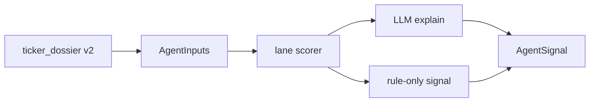

# Agent v2: hybrid specialists

All **22 stock personas** remain registered in [`config/agents_tiers.json`](../config/agents_tiers.json). Each agent now uses a **rule-first + LLM-explain** flow instead of a single open-ended prompt.

## Flow

1. **Pipeline** builds a shared [`ticker_dossier`](../src/data/ticker_dossier.py) v2 per ticker (`dossier_financial_limit=5` by default).
2. **`resolve_agent_inputs`** maps dossier fields into [`AgentInputs`](../src/agents/inputs.py).
3. **Lane scorer** returns a [`RuleScore`](../src/agents/scoring/models.py): `suggested_signal`, `rule_confidence`, `checks[]`, optional `skip_llm`.
4. **`HybridAgentMixin`** calls the LLM to explain in persona voice unless `skip_llm` (clear congressional flow).
5. **Post-process**: signal stays at rule suggestion unless `override=true` with `override_reason`; confidence clamped to `rule_confidence ± 15` (max 85 unless ≥3 checks pass).

## Lanes and modules

| Lane | Scoring module | Example agents |
|------|----------------|----------------|
| value | `value_checklist` | Warren Buffett, Ben Graham, fundamentals_analyst |
| valuation | `valuation_screen` | Aswath Damodaran, valuation_analyst |
| growth | `growth_trends` | Cathie Wood, Peter Lynch, growth_analyst |
| technicals | `technicals_signals` | technicals_analyst |
| macro | `macro_momentum` | Stanley Druckenmiller |
| distress | `distress_screen` | Michael Burry |
| sentiment | `sentiment_news` | sentiment_analyst, news_sentiment_analyst |
| congressional | `congressional_flow` | congressional_trader |

Persona flavor is the **`hybrid_profile`** string passed to the scorer (e.g. `graham` vs `buffett` thresholds on P/B).

## Overrides

- Set `override: true` in LLM JSON only when a **cited fact** in the dossier contradicts the rule signal.
- Expect `override=true` to be rare in production logs.

## Adding a persona

1. Register in [`initialize.py`](../src/agents/initialize.py) and tiers JSON.
2. Subclass `BaseAgent` + `HybridAgentMixin`; set `hybrid_lane` and `hybrid_profile`.
3. Implement `analyze()` as `return self.run_hybrid_analysis(...)`.
4. Override `enrich_inputs()` only for lane-specific fetches (congressional trades, analyst recs).
5. Add scorer profile thresholds if needed in the lane module.

**Crypto** (`crypto_analyst`) stays on the legacy path and separate pipeline.

## Config

- `run_config["dossier_financial_limit"]` — periods for dossier build (default **5**)
- See [`RUN_PROFILES.md`](RUN_PROFILES.md) for profile keys

## Tests

- Scorers: `tests/test_scoring_*.py`
- Hybrid clamp/override: `tests/test_hybrid_agent.py`
- Dossier v2: `tests/test_ticker_dossier_v2.py`
